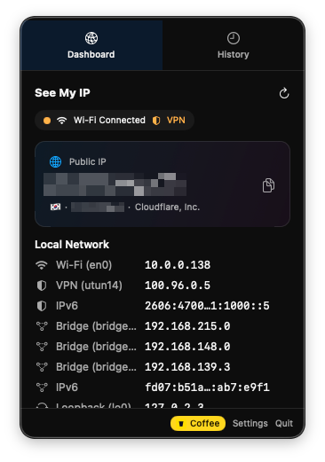
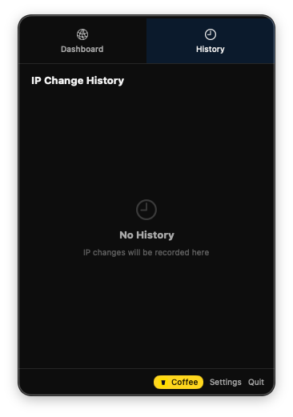

# See My IP

A lightweight macOS menu bar app that displays your public and local IP addresses at a glance.


## Screenshots

<p>
  
  
</p>

## Features

- **Menu Bar Integration** — Always visible in your menu bar with customizable display modes (icon, public IP, local IP, summarized)
- **Public IP Detection** — Fetches your public IP using multiple providers (ipify, ifconfig.me, AWS CheckIP) with automatic fallback
- **Local Network Interfaces** — Shows all local network interfaces with IPv4/IPv6 addresses
- **GeoLocation** — Displays country, city, ISP, and timezone for your public IP
- **VPN Detection** — Automatically detects active VPN connections
- **IP Change History** — Tracks and records IP address changes over time
- **Notifications** — Get notified when your public IP changes
- **Network Monitoring** — Real-time network change detection with smart debouncing
- **Copy to Clipboard** — One-click copy for any displayed IP address
- **Manual Update Check** — Check for new versions via GitHub Releases
- **Power Efficient** — Optimized to minimize battery drain

## Menu Bar Display Modes

| Mode | Example |
|------|---------|
| Icon Only | `IP` |
| Public IP | `203.0.113.42` |
| Public IP (Summary) | `.42` |
| Local IP | `192.168.1.10` |
| Local IP (Summary) | `.10` |

## Requirements

- macOS 14.0 (Sonoma) or later
- Xcode 15+ (for building from source)

## Installation

### Build from Source

```bash
git clone https://github.com/clover4282/see-my-ip.git
cd see-my-ip
xcodebuild -scheme SeeMyIP -configuration Release build
```

The built app will be in `~/Library/Developer/Xcode/DerivedData/SeeMyIP-*/Build/Products/Release/SeeMyIP.app`.

## Settings

- **Display** — Menu bar display mode, IP format (full/masked/hidden for IPv4/IPv6), local interface selection
- **Behavior** — Auto-refresh interval, launch at login
- **Notifications** — IP change alerts with optional sound
- **Update** — Manual update check via GitHub Releases

## Project Structure

```
SeeMyIP/
├── App/                    # App entry point, constants, app delegate
├── Models/                 # Data models (IP, GeoLocation, History)
├── Services/               # Network, clipboard, notification, update services
├── Utilities/              # IP formatting, country flags, interface resolver
├── ViewModels/             # Dashboard view model
├── Views/
│   ├── Dashboard/          # Main dashboard, public/local IP cards, geo info
│   ├── History/            # IP change history list
│   ├── Settings/           # Settings tabs (display, behavior, notifications)
│   └── Shared/             # Reusable UI components
└── Resources/              # Info.plist, entitlements, assets
```

## License

MIT

## Author

[@clover4282](https://github.com/clover4282)

---

<a href="https://buymeacoffee.com/clover4282" target="_blank"></a>
